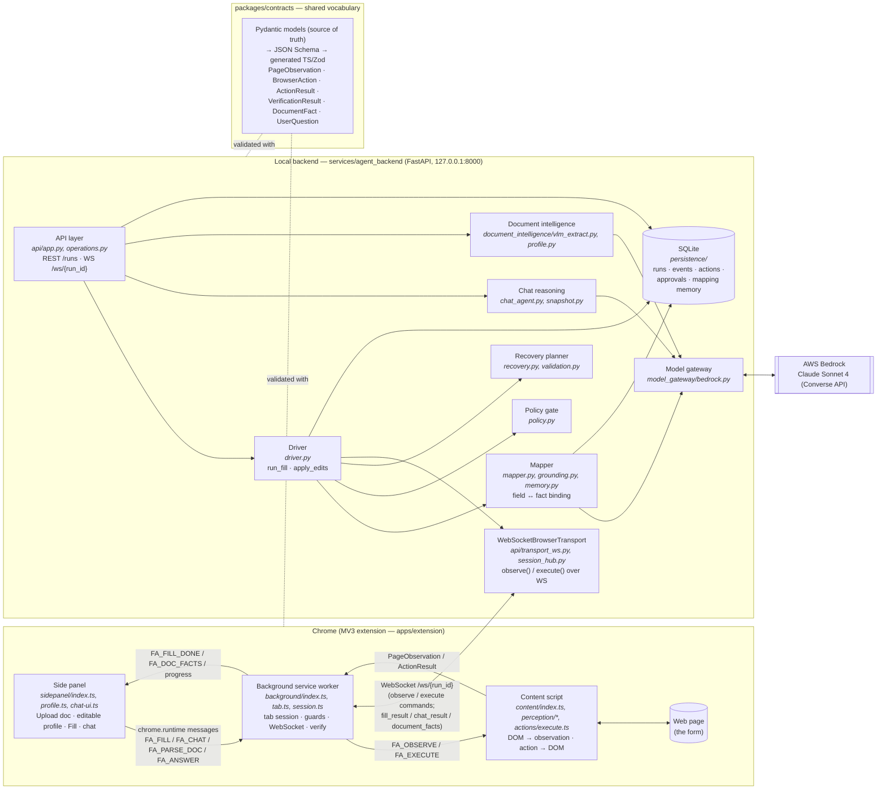
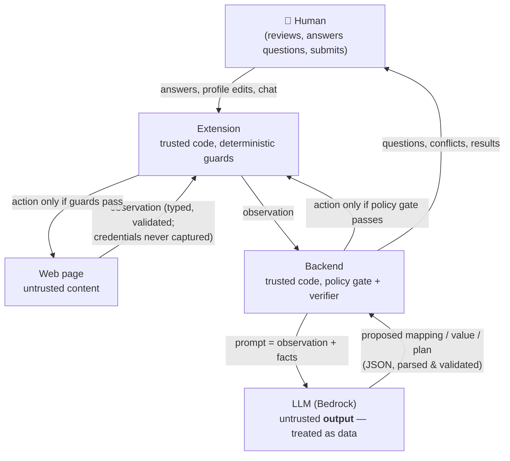
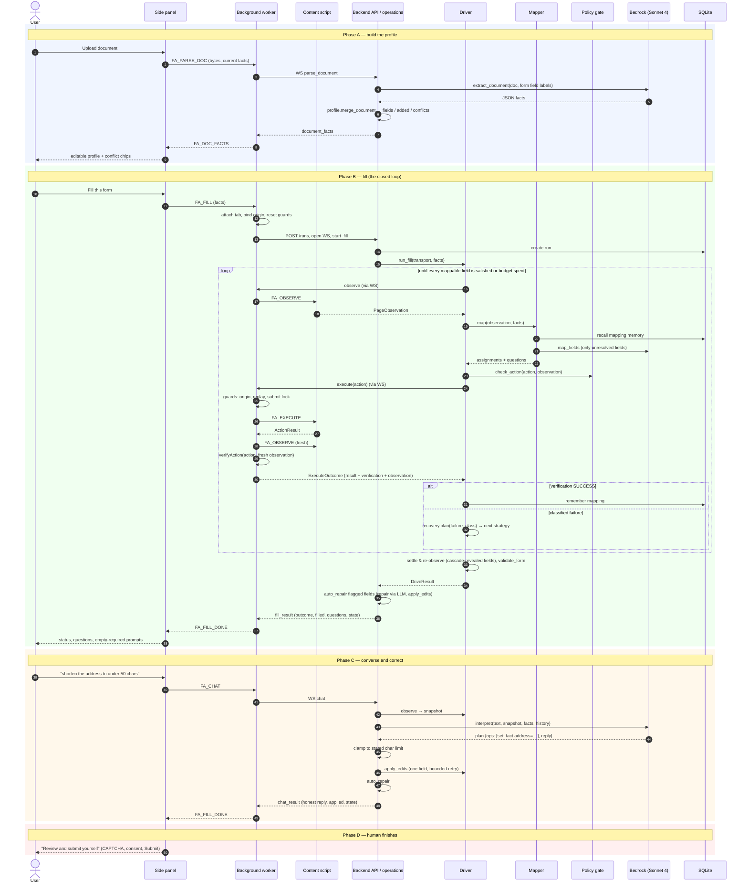
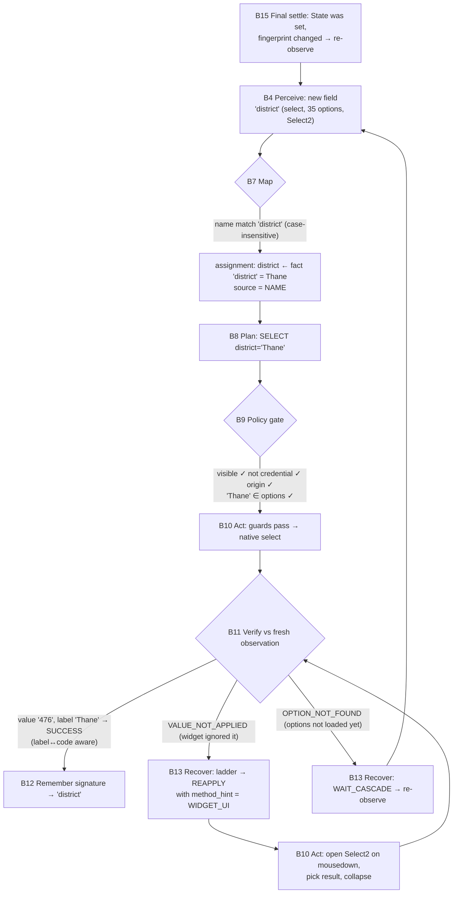

# Form Agent — Architecture and the Form-Filling Journey

_Last updated: 2026-09-10. Companion to `PROGRESS.md` (status/runbook) and
`plan.md` (original design)._

This document has three parts:

1. **The architecture** — the components, where they run, and the trust
   boundaries between them (with diagrams).
2. **The form-filling journey** — what happens, step by step, from "Upload a
   document" to "review and submit yourself", with every step mapped onto the
   component that performs it.
3. **Design principles** — why it is shaped this way.

---

## 1. Architecture

### 1.1 The one-paragraph version

The system is a **deterministic control loop with an LLM injected at five
bounded, verified points**. A Chrome extension is the *eyes and hands* on the
page; a local backend is the *brain*; a shared contracts package is the
*vocabulary* both speak. Every value the model proposes is treated as **data**:
it is re-validated by a policy gate, executed by deterministic code, and then
independently verified against a fresh observation of the page. The human
always submits; the agent never does.

### 1.2 Component diagram

### 1.3 Where each responsibility lives

| Responsibility | Component | Key file(s) |
|---|---|---|
| Product surface (upload, profile, fill, chat) | Side panel | `sidepanel/index.ts`, `profile.ts`, `chat-ui.ts` |
| Own the tab session; **guards** (origin binding, replay/idempotency, submission lock) | Background worker | `background/tab.ts`, `guards/session-guards.ts` |
| Backend connection; survive MV3 worker recycling | Background worker | `background/session.ts` (`chrome.storage.session` + reconnect) |
| **Perceive** the DOM into a typed observation — native controls *and* role-based (ARIA) widgets, by role and state; labels, options, `maxlength`, `autocomplete`, errors; never capture credentials | Content script | `perception/fields.ts`, `aria.ts`, `widgets.ts`, `page.ts` |
| **Act**: one validated action → DOM (incl. Select2 widgets) | Content script | `actions/execute.ts` |
| **Verify** independently against a fresh observation | Background worker | `verification/verify.ts` |
| Run/session lifecycle, REST + WS endpoints, dispatch panel operations | API layer | `api/app.py`, `api/operations.py` |
| Drive the page from the backend as if it were local | Transport | `api/transport_ws.py`, `api/session_hub.py` |
| The closed loop: perceive → map → gate → act → verify → recover | Driver | `driver.py` (`run_fill`, `apply_edits`) |
| Bind form fields to profile facts (deterministic first, model last) | Mapper | `mapper.py`, `grounding.py`, `memory.py` |
| Re-validate every action; model output grants nothing | Policy gate | `policy.py` |
| Classify failures and choose the next bounded strategy | Recovery | `recovery.py`; form-level checks in `validation.py` |
| Understand a chat request in the context of the live form | Chat reasoning | `chat_agent.py` (plan), `snapshot.py` (form state) |
| Document → profile facts; merge/dedupe/conflicts | Document intelligence | `vlm_extract.py`, `profile.py` (Textract fallback: `extract.py`) |
| Talk to the LLM (JSON chat, multimodal extraction) | Model gateway | `model_gateway/bedrock.py`, `factory.py`, `fake.py` |
| Durable state: runs, events, actions, approvals, **mapping memory** | Persistence | `persistence/models.py`, `repository.py` |
| The types everything is validated against | Contracts | `packages/contracts/python/form_contracts/*` |

### 1.4 Trust boundaries

Three rules follow from the diagram:

- **The page is untrusted input.** It is perceived into a typed
  `PageObservation`; credential fields are never captured; page text never
  becomes an instruction to the model beyond being data in a prompt.
- **The model is untrusted output.** It returns JSON that is parsed into
  contract types and then must pass the policy gate (`policy.py`) and the
  extension guards before anything touches the page. A sensitive fact bound
  by the model or memory alone is escalated to the human
  (`QuestionKind.SENSITIVE_MAPPING`).
- **The human holds the only submit key.** There is no code path that submits
  without a human approval token, and the panel never issues one.

### 1.5 The five LLM touchpoints

Everything else is deterministic code. Each point has a fallback if Bedrock is
unavailable.

| # | Touchpoint | Called from | Input → Output | If the model is down |
|---|---|---|---|---|
| 1 | **Field → fact mapping** | `mapper.py` | unresolved fields + fact keys → `{field_id: fact_key}` | abstain → ask the user |
| 2 | **Value derivation** | `derivation.py` via mapper | facts → a value not literally in the profile | field left for the user |
| 3 | **Chat interpretation** | `chat_agent.py` | request + form snapshot + facts → small plan (`set_fact` / `refill` / `explain`) | keyword fallback parser |
| 4 | **Document extraction (VLM)** | `vlm_extract.py` | PDF/image bytes + target field labels → facts | Textract + recognizer |
| 5 | **Repair** | `chat_agent.repair_values` | field, its error text, current value → corrected value | issue reported to the user |

---

## 2. The form-filling journey

The journey has four phases. Each step below names the component that performs
it (matching §1.2), so the narrative can be read against the diagram.

### 2.0 Sequence overview

### Phase A — Build the profile from a document

| Step | What happens | Component |
|---|---|---|
| A1 | The user clicks **📄 Upload** and picks a PDF/image. If a profile already exists, the panel asks **"Add to current, or start new?"** | Side panel (`sidepanel/index.ts`: `askProfileChoice`) |
| A2 | The file is base64-encoded and sent with the current profile facts. | Side panel → Background (`FA_PARSE_DOC`) |
| A3 | The background ensures a backend session exists (creating a run and WebSocket if needed) and sends `parse_document`. | Background (`session.ts`: `parseDocument`, `ensureConnection`) |
| A4 | The document is stored (encrypted blob) and extracted. **VLM first**: the model reads the document *directly* — tables, handwriting, abbreviations — and is told which field labels the current form has, so it returns facts aligned to the form (and infers obvious relations such as nationality → country). Textract is the fallback. | API (`operations.parse_document`, `_extract_profile`) → Document intelligence (`vlm_extract.py`) → Gateway (`bedrock.extract_document`) |
| A5 | The extracted facts are **merged** with the existing profile: new key → *added*; same value → *deduped*; different value → *conflict*. | `profile.merge_document` |
| A6 | The panel shows the editable profile (a `key: value` textarea) and one chip-prompt per conflict ("Which value for `phone`?"). The user can edit values, add fields the form needs, or clear. | Side panel (`ProfileEditor`, `askConflict`) |

**Output of Phase A:** a list of `ChatFact` (`key`, `value`, sensitivity)
living in the panel — the profile the fill will use.

### Phase B — Fill the form (the closed loop)

This is the heart of the system: `driver.run_fill`. Every iteration is
perceive → map → gate → act → verify → recover.

| Step | What happens | Component |
|---|---|---|
| B1 | **Fill this form.** The panel persists the profile and sends the facts. | Side panel → Background (`FA_FILL`) |
| B2 | **Attach.** The background binds the session to the active tab's origin, injects the content script, resets the replay counter, and clears approvals. | Background (`tab.ts`: `attachToTab`, `resetActionSequence`) |
| B3 | **Start a run.** `POST /runs` creates a durable run; the WS `/ws/{run_id}` opens and the panel op `start_fill` is dispatched to a worker thread with a `WebSocketBrowserTransport`. | API (`app.py` WS loop → `operations.start_fill` → `_run_in_worker`) → Persistence |
| B4 | **Perceive.** The driver calls `transport.observe()`; the background asks the content script for a fresh `PageObservation` (fields with labels, types, options, `maxlength`, `autocomplete`, validity/error text, dialogs, navigation controls, a page fingerprint). Each field also carries a **purpose** judged from its own text (`perception/purpose.ts`): *credential* (password/OTP/PIN — never read, never written), *captcha* (never written), *consent* (only on the user's explicit yes), or *standard* — which includes a masked identifier such as Aadhaar rendered as a password input, whose value stays on the page (only its length is observed). A modal that contains the form is flagged `contains_form` so it is never dismissed. Controls are recognised **by role and state**, not by implementation: a `div role="radio" aria-checked` is a radio, a `role="listbox"` with options is a select, a contenteditable is a textbox (`perception/aria.ts`), interleaved with native inputs in DOM order. What has a role but no executor (a slider, a tree) is reported in `unrecognized_controls` rather than skipped. | Driver → Transport → Background → Content script (`perception/*`) |
| B5 | **Settle.** If the page reports pending mutations (a cascade loading, a widget opening), the driver waits and re-observes before mapping, so dependent fields and their options exist. | Driver (`WAIT_STABLE` action) |
| B6 | **Dismiss** blocking dialogs (cookie banners etc.) through the same gate/execute path. | Driver → Policy gate → Content script |
| B7 | **Map.** Each field is bound to a fact in strict trust order: (1) exact/case-insensitive name match → (2) W3C `autocomplete` token grounding → (3) **episodic memory** of past successful bindings for the same value-free field signature → (4) the **model**, restricted to the unresolved fields and the available fact keys → (5) value derivation. Every assignment records its `MappingSource`. A *sensitive* fact bound only by model/memory is turned into a question instead of an action. When the model finds a *plausible but uncertain* candidate (an abbreviation like `aID` for "Aadhaar Number"), the mapper asks **"you have aID — use it for this field?"** rather than leaving the field empty. A *consent* field is never bound by an indirect signal — only by the user's own answer. | Mapper (`mapper.py` → `grounding.py`, `memory.py`, gateway) |
| B8 | **Plan one action.** The next unsatisfied, unblocked assignment (in document order) becomes a `BrowserAction` (`TYPE`, `SELECT`, `CHECK`, `UPLOAD_FILE`…), with any `method_hint` staged by an earlier recovery (e.g. drive the widget UI instead of the native select). | Driver + Planner (`planner.py`: `build_action_for`, `normalize_value`) |
| B9 | **Gate.** `policy.check_action` re-validates the action against the *current observation*: target exists and is visible; not a credential or captcha (the backend re-derives the purpose itself, `purpose.py`, so an observation can only tighten the rule, never relax it); origin matches; option is a member of the field's options; a value has provenance; no `SUBMIT` without a human approval token. A blocked action never reaches the page. | Policy gate (`policy.py`, `purpose.py`) |
| B10 | **Act.** The action crosses the WS to the background, which runs its own deterministic **guards** (origin binding, sequence/replay, idempotency, submission lock), then hands it to the content script, which performs the DOM interaction: native value-setting with input events, role-generic handling for ARIA widgets (click a radio/checkbox/switch, open a listbox and click its option, type into a textbox), and widget-specific drivers where a library needs them (Select2: open on `mousedown`, pick with `mousedown`+`mouseup`, collapse afterwards). | Transport → Background (`tab.ts`: `execute` + `session-guards.ts`) → Content script (`actions/execute.ts`) |
| B11 | **Verify independently.** The background re-observes the page and runs `verifyAction` against the *fresh* observation (not the executor's claim): is the value present, is the option selected (label ↔ code aware), did a new error appear? The result is a `VerificationResult` with a **`FailureClass`** on failure. | Background (`verification/verify.ts`) |
| B12 | **Learn.** On `SUCCESS` the driver records the field-signature → fact-key binding in **mapping memory** (durable SQLite), so the next visit to this form skips the model (`model_calls: 1 → 0` on pgportal). | Driver → Persistence (`RepositoryMappingMemory`) |
| B13 | **Recover.** On failure, the recovery planner picks the next rung of a **per-failure-class ladder** — e.g. `OPTION_NOT_FOUND → ALT_SELECT → WAIT_CASCADE → NORMALIZE_VALUE → ASK_USER`; `VALUE_NOT_APPLIED → REAPPLY → REOBSERVE → STOP` — bounded per field (`MAX_RECOVERIES_PER_FIELD`). A strategy may stage a method hint, a normalized value, or a re-map for the next attempt. `STOP`/`ASK_USER` blocks the field and raises a `UserQuestion`. | Recovery (`recovery.py`) → Driver (`_apply_recovery_strategy`, `_block_with_question`) |
| B14 | **Loop** until every mappable field is satisfied or the step budget is spent (`DriverBudgets`). | Driver |
| B15 | **Final settle.** When nothing is left, the driver waits for the DOM, re-observes, and if the fingerprint changed (a cascade revealed *District* after *State*), re-enters the loop for the new fields (bounded to three settles). | Driver (`final_settles`) |
| B16 | **Navigate** to the next page if a "Next" control exists (never "Submit"), and repeat from B4. | Driver (`_navigation_action`) → Policy gate |
| B17 | **Validate the form** as a whole: empty required fields, fields showing errors, unexpected values. Outcome becomes `COMPLETED` or `NEEDS_USER` (with `questions` and `validation_issues`). | Driver (`_finish`) → `validation.py` |
| B18 | **Auto-repair.** For every field the page flags after the fill, the backend asks the model for a corrected value given the error text and any `maxlength`, clamps it deterministically, applies it through `apply_edits`, and re-checks — up to two rounds. | API (`operations.auto_repair`) → Chat reasoning (`repair_values`, `clamp_length`) → Driver (`apply_edits`) |
| B19 | **Report.** `fill_result` carries outcome, filled fields, open questions, validation issues, and a **snapshot** of the live form state (text summary, new fields, empty required, errors). | API (`_fill_payload`, `snapshot.summarize`) → Background → Side panel |
| B20 | The panel shows the banner ("Filled 11 fields. Nothing submitted."), and asks about what is left *according to what each field is for*: a proposed binding gets **"Yes, use aID" / "No"** chips (Yes → `FA_BIND`, filled from the existing fact and remembered for the site); a consent gets **"Tick it" / "Leave it"**; a captcha or OTP is announced as yours to complete on the page; an ordinary empty required field gets a value prompt whose answer is applied to that field as a one-off (`FA_SET_FIELD`), not stored in the profile. The composer unlocks. | Side panel (`showFillResult`, `askQuestion`, `askEmptyField`) |

**Persistence during Phase B:** each fill and each chat edit appends a
value-free **trace** event (`fill_trace` / `edit_trace`: the fields seen with
their purpose and filled state, unrecognised controls, what was filled, every
verification and recovery decision, policy blocks, model calls), so "why
didn't it fill X?" is answered from `GET /runs/{id}/events`, not guesswork.

### Phase C — Converse and correct

The chat is a reasoning layer *over live form state*, not a command parser.

| Step | What happens | Component |
|---|---|---|
| C1 | The user types a request ("set state to Karnataka", "i'm female", "shorten the address to under 50 characters", "change it back"). | Side panel → Background (`FA_CHAT`) |
| C2 | The background reuses the persisted session (reconnecting the WS if the MV3 worker was recycled), resets the action sequence, and sends `chat` with the text, facts, and recent change history (for undo). | Background (`session.ts`: `chatTurn`, `recordChange`) |
| C3 | **Perceive again.** The backend observes the page and builds a **snapshot**: every field with its current value, filled/empty status (placeholder-aware), options/labels, `max_length`, errors, and what changed since the last snapshot. | API (`operations.chat`) → `snapshot.build_snapshot` |
| C4 | **Interpret.** The model receives the request, the snapshot, the facts, and history, and returns a small **plan**: `set_fact` (key, value), `bind` (this fact key belongs in that field — "aid is my aadhaar id" is a statement about *meaning*, not a value), `refill`, or `explain`, plus a reply. Choices are shown to it for fields with ≤15 options so a typo ("fmale") can be resolved to a real option; a stated character limit is parsed deterministically and **clamped** regardless of what the model counted. Fallback: a keyword parser if Bedrock is unavailable. | Chat reasoning (`chat_agent.interpret_or_fallback`, `parse_char_limit`, `clamp_length`) → Gateway |
| C5 | **Act on one field.** `apply_edits` targets only the affected field(s), with bounded retries and the same gate → execute → verify path as Phase B. It reports `filled`, `failed`, and `unresolved` (a value that matched no option). | Driver (`apply_edits`) → Policy gate → Transport → Extension |
| C6 | **Repair** anything the edit caused the page to flag. | API (`auto_repair`) |
| C7 | **Answer honestly.** The reply says what actually changed; for an unresolved value it offers the field's choices instead of a false "done", and only facts that actually landed are reported as `applied` — so a value the form rejected never silently overwrites the profile. The new state snapshot rides along. | API (`_edit_reply`) → Side panel |
| C8 | **Answering a question** works the same way: a chip or typed value becomes a fact and triggers a targeted re-fill. | Side panel (`answer`) → Background (`FA_ANSWER`) |

### Phase D — The human finishes

The agent stops at the boundary it is designed never to cross: it does not
solve CAPTCHAs, tick consent boxes it cannot read, or press **Submit**. The
panel says so ("Everything checks out — review and submit yourself"), and the
submission lock in the extension guards plus `SUBMIT_WITHOUT_APPROVAL` in the
policy gate make that a property of the code, not of the prompt.

### 2.1 One field, end to end

To make the mapping concrete, here is the life of a single field — the
pgportal **District** dropdown, which only appears after **State** is chosen
and is a Select2 widget that ignores programmatic `change` events.

---

## 3. Design principles

1. **Deterministic skeleton, bounded LLM.** The loop, the gate, the verifier,
   the guards, and the recovery ladders are plain code with tests. The model is
   consulted only where judgement is genuinely needed, and its output is always
   checked by something that does not trust it.
2. **Perceive, don't assume.** Every decision — mapping, gating, verification,
   chat interpretation — is made against a *fresh* observation, so cascades,
   validation errors, and page changes are seen rather than guessed.
3. **Verify independently.** The executor's "I did it" is never the source of
   truth; the verifier re-observes and compares, with label ↔ code awareness.
4. **Fail with a name.** Failures are classified (`FailureClass`) so recovery
   can be *specific* (a cascade waits; a widget gets a UI driver; a bad value is
   normalized) and *bounded* (per-field ladder, step budget), then escalates
   to the human with a clear question.
5. **Trust by provenance.** Every mapping records where it came from; sensitive
   values need a trusted binding or a human's confirmation.
6. **Learn cheaply.** Successful bindings are remembered by a value-free field
   signature, so repeat visits are faster and cheaper without storing personal
   data in memory.
7. **Contracts at every boundary.** Pydantic is the source of truth; TS types
   are generated; drift fails CI. The extension and the backend cannot silently
   disagree about what a field or an action is.
8. **The human submits.** Never auto-submit; credentials never leave the page;
   questions, conflicts, CAPTCHAs, and submission are the user's.
