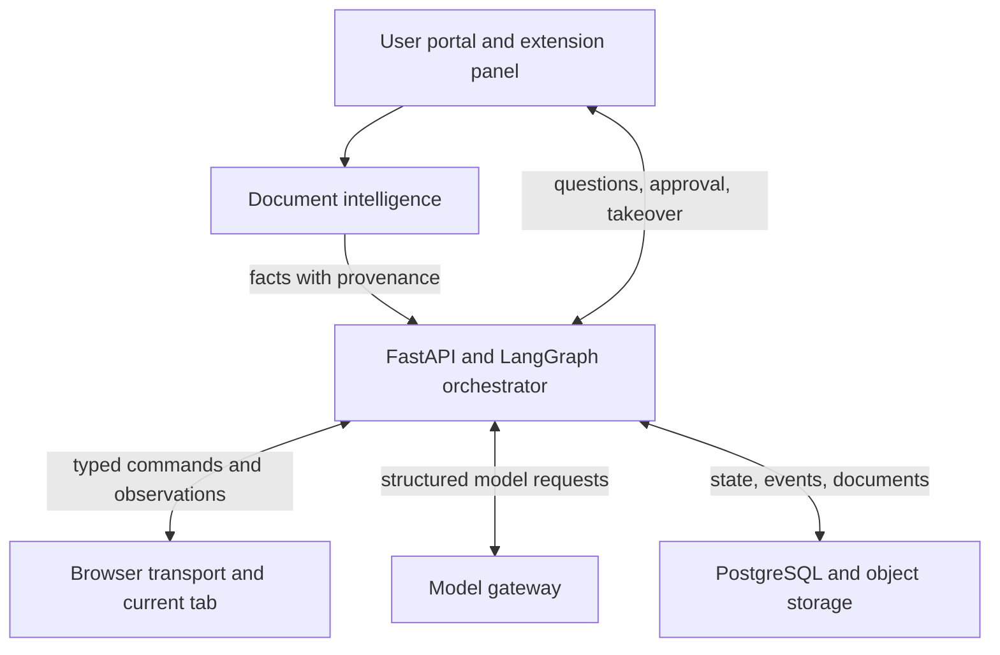
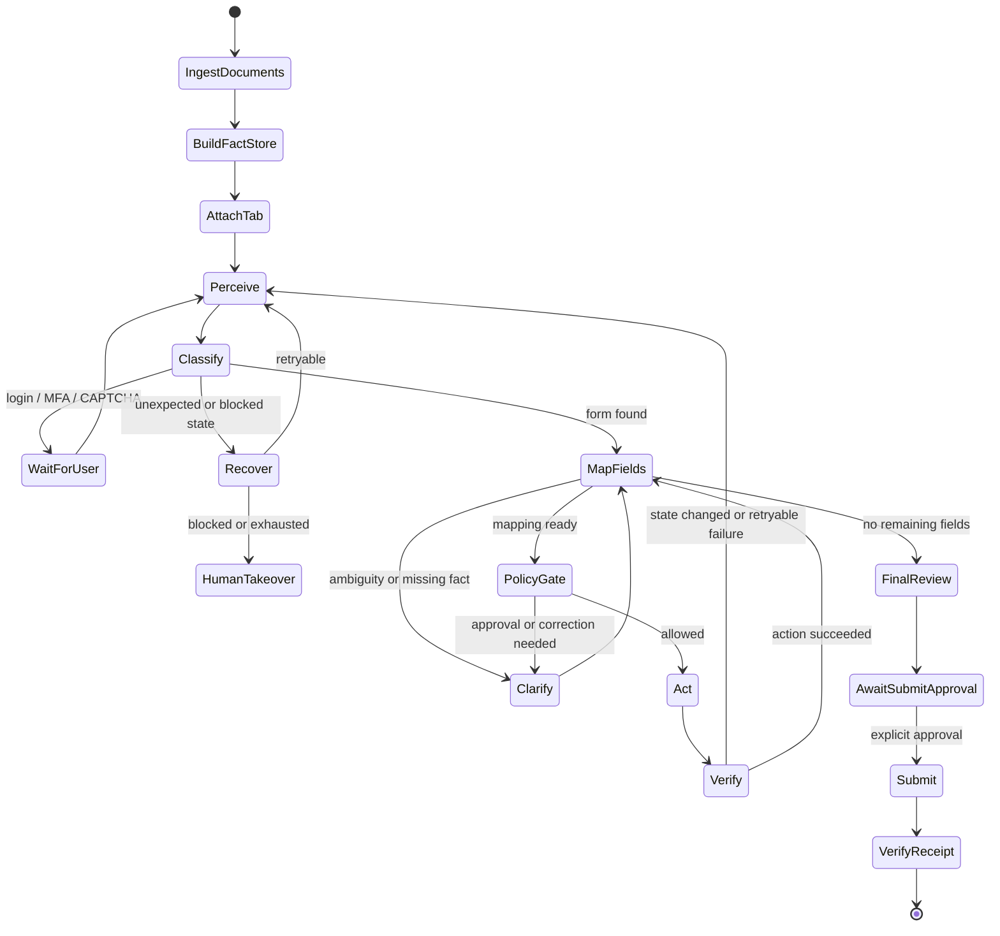
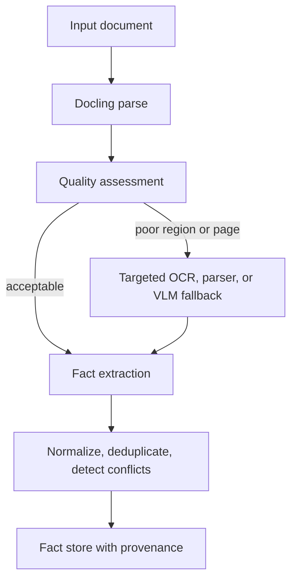

# Agentic Form-Filling System: Architecture and Implementation Plan

## 0. Purpose of this document

This document is the authoritative development handoff for a production-oriented agentic system that extracts facts from user documents and fills multi-page web forms in the user's **currently open browser tab**.

The target is both:

1. A deployable, security-conscious system that can operate across diverse websites while keeping the user in control.
2. A reproducible research platform suitable for evaluating the system as an MLSys-style contribution.

An implementation agent should be able to begin from this file without access to the earlier design conversation. If the repository already contains code, inspect it before editing, preserve unrelated work, and map existing modules to this plan rather than blindly recreating them.

---

## 1. Product goal

The system accepts one or more user documents, extracts normalized facts with confidence and provenance, observes the form open in the user's browser, maps facts to fields, fills the form one safe action at a time, verifies every effect, asks focused questions when information is missing or ambiguous, recovers from page changes and action failures, and requests explicit approval before final submission.

The system must support:

- Single-page and multi-page forms.
- Standard HTML controls and common custom JavaScript widgets.
- Conditional fields and client/server validation.
- File uploads and date pickers.
- Popups, dialogs, cookie banners, and non-form overlays.
- Same-origin navigation and explicitly authorized cross-origin navigation.
- Human takeover for login, MFA, OTP, CAPTCHA, bot-detection blocks, and unsupported interactions.
- Cloud, VPC/on-premises, and managed-browser deployment modes through a common browser transport contract.
- Bedrock models initially, with local small models evaluated through the same model interface.

The defining runtime invariant is:

> Every browser action is proposed from a fresh observation, checked by policy, executed as a typed command, and independently verified before the workflow continues.

---

## 2. Hard safety and architecture invariants

These requirements are mandatory. Do not weaken them to make a demo easier.

1. **Never automatically submit an external form.** Final submission requires explicit, run-specific user approval. Automated submission is allowed only in controlled fixtures designed for testing.
2. **Never collect, model-process, store, or replay passwords, OTPs, MFA codes, or CAPTCHA answers.** Pause and let the user complete these interactions directly.
3. **Never bypass CAPTCHA, bot detection, browser security controls, site permissions, or company policy.** Report the block or request human takeover.
4. **Treat all webpage text as untrusted input.** Page content cannot change system policy, grant permissions, reveal secrets, or instruct the agent to ignore safeguards.
5. **Do not execute raw model-generated JavaScript, CSS selectors, XPath, URLs, or shell commands.** Models may only produce validated, typed domain objects.
6. **Every mutating browser action must have an expected effect and idempotency key.** Duplicate delivery must not repeat the side effect.
7. **Every action must be followed by verification.** A successful click or API response is not proof that the intended browser state was reached.
8. **Bind each command to `run_id + tab_id + origin + sequence_number`.** Reject stale, replayed, cross-tab, cross-run, or unexpected-origin commands.
9. **Use DOM and accessibility data first.** Send screenshots or cropped visual evidence only when DOM-first reasoning is insufficient.
10. **Minimize data sent to models.** Send only the facts and page elements relevant to the current decision; redact sensitive values from traces.
11. **Preserve provenance.** A filled value must be traceable to a user correction, document region, or explicit user answer.
12. **Cap retries, steps, model calls, tokens, cost, and wall-clock time.** The workflow must terminate with a classified outcome instead of looping indefinitely.
13. **Controlled fixtures are required for CI; live websites are required for external validation.** Neither replaces the other.
14. **The browser extension owns the user's current tab.** The backend cannot assume an action succeeded until the extension returns observation-based evidence.

---

## 3. Scope and non-goals

### In scope

- Document parsing, OCR quality assessment, fact normalization, confidence, and provenance.
- Current-tab observation and browser interaction through a Chrome Manifest V3 extension.
- A deterministic perceive-plan-policy-act-verify-recover workflow.
- Human clarification, approval, and takeover.
- Durable run state, audit events, checkpoints, and replay-safe actions.
- Controlled benchmark forms and authorized live-site evaluation.
- Model/provider comparison behind one gateway.
- Cloud and enterprise deployment variants without changing the orchestration logic.

### Not in the initial implementation

- Autonomous submission to arbitrary live websites.
- CAPTCHA solving or anti-bot evasion.
- Password managers or credential automation.
- A vector database; PostgreSQL is sufficient for structured facts and provenance initially.
- Independent microservices for every logical agent.
- Kafka, Temporal, Kubernetes operators, or a complex event platform.
- CrewAI/AutoGen-style free-form agent conversations.
- A generic browser automation product unrelated to form filling.
- Running multiple expensive document parsers on every input by default.

---

## 4. System architecture



### 4.1 Main deployable components for the first complete prototype

1. **Chrome extension**
   - Attaches to the user's current tab after an explicit user gesture.
   - Observes DOM/accessibility state.
   - Executes validated browser actions.
   - Verifies immediate local effects.
   - Hosts a React side panel for status, questions, approval, and takeover.

2. **Agent backend**
   - FastAPI endpoints and secure WebSocket session.
   - LangGraph state machine.
   - Typed policy, planning, action dispatch, verification, recovery, and human-interaction modules.
   - Model gateway and provider adapters.

3. **Document worker**
   - Docling-based parsing first.
   - OCR/layout quality assessment.
   - Targeted alternate parser/OCR/multimodal fallback when quality is poor.
   - Normalized fact extraction with confidence and provenance.

4. **Persistence layer**
   - PostgreSQL for runs, facts, mappings, checkpoints, approvals, and audit events.
   - MinIO/S3 for encrypted documents and optional cropped visual evidence.
   - Required from Slice 4 onward. Slices 1–3 may run on in-memory or SQLite state so the early loop stays fast and Docker-free (see Section 15).

The logical agents should initially remain Python modules inside one backend service. Split them into separate services only if profiling, isolation, or scaling requirements justify it.

### 4.2 Optional web portal

A Next.js/React portal can provide document upload, fact review, run history, audit reports, organization policy, and retention controls. It is useful but should not block the first browser vertical slice; the extension side panel can provide the initial UI.

---

## 5. Browser transport abstraction

The orchestration layer must not depend directly on Chrome extension APIs or Playwright. Define a pluggable transport contract:

```ts
interface BrowserTransport {
  attachToCurrentTab(): Promise<TabSession>;
  observe(): Promise<PageObservation>;
  execute(action: BrowserAction): Promise<ActionResult>;
  waitForUser(reason: HumanTakeoverReason): Promise<void>;
  close(): Promise<void>;
}
```

Planned implementations:

- `ExtensionCloudTransport`: extension communicates with a hosted/VPC backend over a secure WebSocket.
- `ExtensionNativeMessagingTransport`: managed extension communicates with a signed local enterprise sidecar.
- `ManagedPlaywrightTransport`: isolated managed browser for authorized automation, tests, or environments where current-tab control is unavailable.
- `ManualAssistanceTransport`: observation and recommendation only; the user performs actions.

The master graph, planner, policy, and verifier must work unchanged across transports.

### 5.1 Current-tab permission model

- Use a user gesture such as **Fill this form** to request scoped access to the active tab.
- Prefer `activeTab` plus narrowly scoped optional host permissions over permanent access to all websites.
- Same-origin multi-page navigation may retain the session; cross-origin navigation may require a new user gesture or previously approved site permission.
- Re-bind and revalidate `tab_id`, origin, and page fingerprint after every navigation.
- Enterprise administrators should be able to configure origin allowlists and sensitive-domain blocklists.

---

## 6. Runtime workflow



### 6.1 Workflow rules

- Re-perceive after every mutation, navigation, significant DOM mutation, and failed verification.
- Plan only a small number of actions ahead; execute one action at a time.
- On failure, diagnose from new evidence rather than blindly replaying the same action.
- A LangGraph interrupt may restart a node when resumed. Side effects must therefore be outside restart-prone logic or guarded by durable idempotency records.
- Persist a checkpoint before and after each externally visible side effect.
- Use deterministic rules before model calls when the condition is reliable, such as input type detection, local value verification, login-field detection, or submit-policy enforcement.

### 6.2 Terminal run outcomes

- `COMPLETED`: authorized submission verified or fill-without-submit goal completed.
- `NEEDS_USER`: waiting for clarification, login, MFA, CAPTCHA, or approval.
- `BLOCKED`: permission, anti-bot, inaccessible iframe, unsupported widget, or policy block.
- `BUDGET_EXHAUSTED`: retry/step/time/model budget reached.
- `FATAL_FAILURE`: unrecoverable internal or data-integrity error.
- `CANCELLED`: user or administrator stopped the run.

---

## 7. Logical agents and module boundaries

These are specialized workers with typed inputs and outputs, not unconstrained agents chatting with each other.

### 7.1 Document parsing agent

Parses PDFs and images into structured text, layout regions, tables, checkboxes, images, and OCR candidates. It reports quality signals instead of pretending every parse is reliable.

### 7.2 Fact extraction agent

Converts parsed content into normalized facts with aliases, types, confidence, conflicts, and source provenance. It never silently resolves conflicting high-impact facts.

### 7.3 Perception agent

Builds a compact page observation from the DOM, accessibility information, visible dialogs, frames, validation state, navigation controls, and optional visual regions.

### 7.4 Planner and field-mapping agent

Maps facts to fields, normalizes values into site-required formats, proposes the next typed action and expected effect, and identifies ambiguity.

### 7.5 Policy agent

Applies deterministic and organization-configurable rules. It blocks credential/CAPTCHA handling, hidden honeypots, unapproved submission, unexpected origins, prompt injection, unsafe clicks, and sensitive-domain actions.

### 7.6 Action executor

Executes exactly one validated action in the browser transport using resilient target descriptors and real browser events.

### 7.7 Verification agent

Independently compares the expected effect to a new observation. Verification should be deterministic when possible, with a model used only for genuinely semantic or visual effects.

### 7.8 Recovery agent

Classifies failures, selects a bounded recovery strategy, and prevents repeated identical attempts. Possible recovery actions include re-observe, scroll, wait for stable DOM, use an alternate locator, ask the user, or stop.

### 7.9 Human-interaction agent

Produces focused questions, correction requests, approval summaries, and takeover instructions. It should ask for the minimum information necessary to proceed.

### 7.10 Master orchestrator

Owns durable run state, invokes the correct worker, enforces transition invariants, tracks budgets, and determines terminal outcomes. No specialist directly takes control of the entire workflow.

---

## 8. Core typed contracts

Define contracts before implementing model calls or browser actions. Python uses Pydantic v2; TypeScript uses generated JSON Schema types plus Zod/runtime validation. Generate shared schemas rather than maintaining divergent hand-written copies.

**Generation direction:** the Pydantic v2 models are the single source of truth. Export JSON Schema from them, then generate the TypeScript types and Zod validators in `packages/contracts` from that JSON Schema. Generated TypeScript output is committed, and CI must fail if regeneration produces a diff.

### 8.1 `DocumentFact`

```json
{
  "fact_id": "fact-dob-1",
  "key": "date_of_birth",
  "value": "1998-04-17",
  "value_type": "date",
  "confidence": 0.96,
  "sensitivity": "personal",
  "status": "extracted",
  "source": {
    "document_id": "doc-passport-1",
    "page": 1,
    "bounding_box": [120, 240, 410, 290],
    "raw_text": "17 APR 1998",
    "parser": "docling"
  }
}
```

### 8.2 `PageObservation`

Must include:

- Run, tab, frame, URL, origin, title, and page fingerprint.
- Observation sequence and timestamp.
- Page classification candidates.
- Visible form controls and stable target descriptors.
- Labels, accessible names, input types, autocomplete hints, options, and nearby text.
- Required, disabled, read-only, visible, checked, and current-value state.
- Validation messages and server/client error regions.
- Visible dialogs, overlays, login/MFA/CAPTCHA indicators, and navigation controls.
- Accessible iframe metadata and shadow-root boundaries.
- DOM mutation/stability information.
- Optional references to redacted/cropped visual evidence, never an unconditional full-page screenshot.

### 8.3 `BrowserAction`

```json
{
  "action_id": "action-184",
  "run_id": "run-42",
  "tab_id": 17,
  "origin": "https://example.test",
  "sequence_number": 12,
  "kind": "SET_TEXT",
  "target": {
    "field_id": "field-dob",
    "role": "textbox",
    "accessible_name": "Date of birth",
    "input_type": "date"
  },
  "value_ref": "fact://fact-dob-1",
  "expected_effect": {
    "field_value": "1998-04-17",
    "validation_error": false
  },
  "risk": "low",
  "idempotency_key": "run-42:page-2:field-dob:1998-04-17"
}
```

The browser receives a resolved value only after policy approval; raw facts should not be broadcast to unrelated page contexts.

### 8.4 Supported initial browser actions

- `SET_TEXT`
- `SET_NUMBER`
- `SELECT_OPTION`
- `SET_CHECKBOX`
- `SET_RADIO`
- `SET_DATE`
- `UPLOAD_FILE`
- `CLICK`
- `SCROLL`
- `DISMISS_DIALOG`
- `WAIT_FOR_STABLE_PAGE`
- `NAVIGATE_NEXT`
- `SUBMIT` — valid only with a matching, unexpired approval token

### 8.5 `VerificationResult`

```json
{
  "action_id": "action-184",
  "status": "SUCCESS",
  "evidence": {
    "observed_value": "1998-04-17",
    "field_valid": true,
    "page_fingerprint": "sha256:..."
  },
  "failure_class": null,
  "recommended_transition": "CONTINUE"
}
```

Verification statuses:

- `SUCCESS`
- `RETRYABLE_FAILURE`
- `NEEDS_REPERCEPTION`
- `NEEDS_USER`
- `BLOCKED`
- `FATAL_FAILURE`

### 8.6 Other required contracts

- `TabSession`
- `FormField`
- `FieldMapping`
- `ActionPlan`
- `ExpectedEffect`
- `ActionResult`
- `PageClassification`
- `UserQuestion`
- `UserAnswer`
- `ApprovalToken`
- `HumanTakeoverReason`
- `RunState`
- `AgentEvent`
- `ModelRequest` and `ModelResponseMetadata`
- `PolicyDecision`
- `BudgetState`

---

## 9. Field targeting and browser behavior

Use resilient semantic targeting in this order:

1. Accessibility role and accessible name.
2. Associated HTML label.
3. `name`, `autocomplete`, input type, and placeholder.
4. Nearby visible text and grouping such as `fieldset`/`legend`.
5. Stable DOM ancestry and element attributes.
6. Bounding box and targeted visual reasoning as fallback.
7. Raw CSS/XPath only as a last-resort derived locator, never as an unvalidated model instruction.

The executor must emit real user-like browser events as required by the widget: focus, key/input, change, blur, and framework-compatible setters. Directly assigning `element.value` is insufficient for many React/Vue applications.

The content script should support:

- Mutation observation and page-stability detection.
- Open shadow roots.
- Accessible same-origin and permission-authorized frames.
- Detection of stale element references through observation IDs/page fingerprints.
- Local post-action value and validation checks.
- Clear reporting for inaccessible cross-origin frames.

---

## 10. Document intelligence and fact store

### 10.1 Pipeline



### 10.2 Initial parser strategy

- Use Docling as the initial parser.
- Benchmark MinerU as a challenger on the same golden dataset rather than selecting it from marketing claims.
- Use OpenCV plus PDFium/PyMuPDF for rendering, rotation, cropping, and image preprocessing.
- Trigger alternate OCR/parser/multimodal analysis only for low-quality pages or regions.
- Keep the original source region and parser metadata for every extracted fact.

### 10.3 Required document benchmark coverage

- Digital PDFs.
- Scanned documents.
- Rotated, skewed, noisy, and low-resolution pages.
- Multi-column layouts.
- Bordered and borderless tables.
- Merged cells.
- Checked and unchecked boxes.
- Images containing text.
- Printed handwriting and cursive handwriting.
- Mixed-language documents where relevant to the product scope.
- Conflicting values across multiple documents.

### 10.4 Fact-store behavior

- Normalize dates, phone numbers, names, addresses, identifiers, units, and enumerations without discarding the raw value.
- Preserve multiple candidates and conflicts.
- User corrections create a new authoritative fact version and retain audit history.
- Facts have sensitivity labels and purpose-bound access.
- Low-confidence or conflicting facts trigger clarification before use.

---

## 11. Model gateway and model strategy

The rest of the system must never call a specific provider or model directly.

```python
class ModelGateway(Protocol):
    async def map_fields(self, request: MappingRequest) -> FieldMappingBatch: ...
    async def plan_action(self, request: PlanningRequest) -> ActionPlan: ...
    async def classify_obstacle(self, request: ObstacleRequest) -> PageClassification: ...
    async def extract_visual_facts(self, request: VisualFactRequest) -> list[DocumentFact]: ...
```

Initial adapters:

- `BedrockModelAdapter` using the Bedrock Converse API and schema-constrained output when supported.
- `OpenAICompatibleLocalAdapter` for vLLM/SGLang/local inference servers.
- `FakeModelAdapter` for deterministic unit and graph tests.
- `RecordedModelAdapter` for repeatable integration tests without repeated model cost.

### 11.1 Recommended initial role assignment

| Task | Initial implementation |
| --- | --- |
| Page/field extraction | Deterministic DOM code |
| Straightforward value conversion | Deterministic code |
| Field mapping and ambiguity | Strong suitable Bedrock text model |
| Difficult planning/recovery | Strong suitable Bedrock model |
| Handwriting/visual fallback | Multimodal Bedrock model or later local VLM |
| Policy enforcement | Deterministic code |
| Immediate verification | Deterministic code |
| Semantic/visual verification fallback | Model only when required |
| Low-risk classification experiment | G9v3-3B |
| Agentic planning experiment | Nanbeige4.2-3B |

Use Bedrock first to validate the system architecture. Evaluate `Nanbeige4.2-3B` and `G9v3-3B` as interchangeable local research candidates, not as assumptions baked into the code.

- Nanbeige is the more interesting agentic/tool-use candidate but may require custom runtime work and remains text-only.
- G9 is the simpler local engineering candidate and is also text-only.
- Neither replaces a multimodal fallback for images or handwriting.
- Keep model outputs schema-constrained and validate them again locally.
- Do not add LiteLLM initially; two small explicit adapters are easier to debug. Reconsider only when provider count makes it worthwhile.

### 11.2 Model-request rules

- Send compact fact candidates and compact field observations, not complete raw documents or DOM dumps.
- Never include credentials, OTPs, CAPTCHA content, hidden page values, or irrelevant PII.
- Delimit and label webpage content as untrusted data.
- Record model ID, configuration, latency, token usage, cost, schema-validity result, and redacted request fingerprint.
- Do not store hidden chain-of-thought. Store concise decision categories and observable evidence.
- Enforce timeouts, bounded retries, and a deterministic fallback/abstention path.

---

## 12. Technology stack

| Layer | Technology | Decision |
| --- | --- | --- |
| Agent workflow | LangGraph, Python | State graph, checkpoints, conditional routing, interrupts, recovery |
| Core model/tool wrappers | Provider SDKs plus project code | LangChain helpers optional; do not use AgentExecutor as the control plane |
| Backend API | FastAPI + Pydantic v2 | Typed APIs and validated contracts |
| Current-tab integration | Chrome Manifest V3 extension, TypeScript | Primary user-browser transport |
| Extension UI | React side panel | Progress, clarification, approval, and takeover |
| Browser interaction | Native DOM/accessibility APIs | Primary action path |
| Browser automation/testing | Playwright | Extension E2E tests and managed-browser fallback |
| Shared TS validation | Zod/generated schemas | Runtime validation aligned with Pydantic/OpenAPI |
| Document parsing | Docling | Initial parser |
| Parser challenger | MinerU | Benchmark on difficult documents |
| Image/PDF preprocessing | OpenCV + PDFium/PyMuPDF | Rendering, rotation, cropping, enhancement |
| Durable state | PostgreSQL | Runs, facts, events, mappings, approvals, idempotency |
| Binary storage | S3/MinIO | Encrypted documents and visual evidence |
| Live communication | Secure WebSocket | Extension-backend events and commands |
| Portal | Next.js + React | Upload/review/history; optional for the first slice |
| Authentication | OIDC/OAuth + RBAC | User and organization access |
| Telemetry | OpenTelemetry | Correlated traces, metrics, and redacted logs |
| Local deployment | Docker Compose | Reproducible development stack |
| Production deployment | Docker; Kubernetes later if justified | Cloud, VPC, and on-prem variants |
| Local model serving | vLLM or SGLang | GPU-hosted OpenAI-compatible endpoint |
| Python tooling | uv + ruff + pytest | Environment/dependency management, lint/format, unit and integration tests |
| TypeScript tooling | pnpm workspaces + Vitest | Package management and unit tests; Playwright for extension E2E |

---

## 13. Proposed monorepo structure

```text
form-filling-agent/
├── AGENTS.md
├── README.md
├── plan.md
├── pyproject.toml
├── package.json
├── pnpm-workspace.yaml
├── apps/
│   ├── extension/
│   │   ├── src/
│   │   │   ├── background/
│   │   │   ├── content/
│   │   │   ├── perception/
│   │   │   ├── actions/
│   │   │   ├── verification/
│   │   │   ├── transport/
│   │   │   └── sidepanel/
│   │   └── tests/
│   ├── fixtures/
│   └── web/
├── services/
│   └── agent_backend/
│       ├── api/
│       ├── contracts/
│       ├── orchestration/
│       ├── document_intelligence/
│       ├── fact_store/
│       ├── model_gateway/
│       ├── perception/
│       ├── planner/
│       ├── policy/
│       ├── verification/
│       ├── recovery/
│       ├── human_interaction/
│       ├── persistence/
│       └── telemetry/
├── packages/
│   └── contracts/
├── tests/
│   ├── documents/
│   ├── integration/
│   ├── security/
│   └── end_to_end/
├── evals/
│   ├── datasets/
│   ├── runners/
│   ├── metrics/
│   └── reports/
├── infra/
│   ├── docker/
│   └── compose.yaml
└── docs/
    ├── threat-model.md
    ├── protocol.md
    ├── benchmark.md
    └── deployment.md
```

Do not create every empty directory at once unless the repository conventions require it. Scaffold the portions needed by the active vertical slice.

---

## 14. Module-by-module implementation and test plan

### Module 0: Repository guardrails and shared contracts

**Implement**

- `AGENTS.md` containing the mandatory invariants from this plan.
- Python and TypeScript contract packages.
- JSON Schema/OpenAPI generation and compatibility checks.
- Common identifiers, enums, error taxonomy, sensitivity labels, and redaction utilities.

**Test**

- Invalid/unknown action types are rejected.
- Required origin, sequence, expected effect, and idempotency fields cannot be omitted.
- Python and TypeScript serialize the same golden messages.
- Sensitive values are redacted in logs and errors.
- Version-incompatible protocol messages fail clearly.

**Acceptance gate**

All shared contract tests pass without any model or browser dependency.

### Module 1: Real-site reconnaissance and controlled benchmark foundation

**Implement**

- An observation-only extension prototype or manual capture template.
- A taxonomy schema for form/page/widget/obstacle characteristics.
- Initial local fixture application with deterministic ground truth and resettable state.

**Research workflow**

- Observe approximately 20–30 diverse real forms without filling or submitting them.
- Cover job applications, education, insurance, travel/visa, healthcare, government, events, e-commerce, customer support, and observation-only banking/KYC where appropriate.
- Record page count, authentication, CAPTCHA, iframe use, widgets, dynamic fields, uploads, popups, and submission policy.
- Reproduce the observed interaction patterns in controlled fixtures without copying proprietary site content.

**Test fixtures must eventually cover**

- Standard text/number/select/radio/checkbox controls.
- Native and custom date pickers.
- Searchable comboboxes.
- File uploads.
- Conditional fields and validation errors.
- Multi-page navigation.
- Cookie banners, newsletter dialogs, and fake ads.
- Login/CAPTCHA placeholders.
- Cross-origin iframe and open shadow DOM.
- Stale elements, delayed rendering, and deliberate navigation failure.

**Acceptance gate**

Fixtures expose machine-readable ground truth, reset reliably, and never perform an external side effect.

### Module 2: Extension perception

**Implement**

- Manifest V3 service worker, content script, and explicit attach flow.
- DOM/accessibility form discovery.
- Dialog, overlay, login, MFA, CAPTCHA, iframe, and navigation-state observation.
- Page fingerprint, observation sequence, mutation monitoring, and stable target descriptors.
- Data minimization and sensitive-value filtering before transmission.

**Test**

- Vitest unit tests for label/role/type resolution.
- Playwright extension tests against controlled fixtures.
- Snapshot/ground-truth comparison for discovered fields.
- Dynamic DOM re-perception.
- Same-origin navigation and denied cross-origin access.
- Hidden honeypot and non-visible element filtering.
- Prompt-injection text is captured only as untrusted content.

**Acceptance gate**

The extension discovers all actionable fields in the initial fixture suite without an LLM and without modifying the page.

### Module 3: Deterministic browser action executor

**Implement**

- Initial typed action set.
- Semantic target resolution.
- Framework-compatible event dispatch.
- Sequence, run/tab/origin, stale-observation, and idempotency checks.
- Submission lock requiring a valid approval token.

**Test**

- Text, number, select, checkbox, radio, date, upload, click, scroll, and navigation behavior.
- React/Vue handlers receive real changes.
- Custom date/combobox fixtures survive blur and re-render.
- Duplicate idempotency keys do not repeat actions.
- Wrong tab/origin/sequence commands are rejected.
- `SUBMIT` is impossible without fixture mode or valid explicit approval.

**Acceptance gate**

Hard-coded facts can safely fill the first controlled form in the current tab, one typed action at a time.

### Module 4: Verification and failure taxonomy

**Implement**

- Expected-versus-observed comparison.
- Field value/validity checks.
- Conditional-field, navigation, notification, and receipt checks.
- Failure classification and evidence capture.
- Verifier false-positive instrumentation.

**Test**

- Correct action returns `SUCCESS`.
- Wrong value or remaining validation error never returns success.
- Click without intended effect is detected.
- Unexpected page change requests re-perception.
- Login/CAPTCHA state requests user takeover.
- Server-side rejection is classified correctly.

**Acceptance gate**

Every supported action has at least one success, retryable-failure, and false-success test.

### Module 5: Document intelligence

**Implement**

- Secure upload and document identity.
- Docling parser adapter.
- Page/region quality scoring.
- Fact extraction, normalization, confidence, provenance, conflict handling, and user correction.
- Fallback interface for MinerU/OCR/multimodal parsing.

**Test and measure**

- Golden document cases covering the formats listed in Section 10.
- Character/word error rate.
- Table structure accuracy.
- Field-value exact match and normalized-value accuracy.
- Provenance bounding-box overlap.
- Confidence calibration and abstention accuracy.
- Parser failure, malformed file, encrypted PDF, and oversized input behavior.

**Acceptance gate**

The pipeline produces reviewable facts with provenance and abstains on low-quality/conflicting evidence instead of silently guessing.

### Module 6: Model gateway

**Implement**

- Provider-neutral gateway.
- Bedrock, local OpenAI-compatible, fake, and recorded adapters.
- Structured output validation, timeout, retry, redaction, and accounting.
- Prompt-injection-resistant request templates.

**Test**

- Schema-invalid response.
- Timeout, throttling, unavailable model, and partial response.
- Switching models without planner changes.
- Recorded-response determinism.
- No forbidden secret/sensitive fields in model requests or traces.
- Latency, token, and cost metadata.

**Acceptance gate**

The same mapping evaluation case runs through fake, recorded, Bedrock, and local adapters without changing its domain contract.

### Module 7: Field mapper and planner

**Implement**

- Candidate generation using deterministic label/type compatibility.
- Model-assisted ranking/ambiguity resolution.
- Value-format conversion.
- Small action plan with expected effects and confidence.
- Clarification trigger for missing, conflicting, or ambiguous information.

**Test and measure**

- Exact labels and synonyms.
- Current/permanent addresses.
- Date and phone format conversion.
- Conflicting document values.
- Missing required facts.
- Unsupported widgets.
- Required versus optional fields.
- Hidden honeypots and prompt injection.
- Field-mapping accuracy, tool/action exact match, invalid-action rate, unnecessary-question rate, and missed-clarification rate.

**Acceptance gate**

Planner output is always schema-valid, policy-reviewable, provenance-linked, and non-executable until approved by policy.

### Module 8: LangGraph master workflow

**Implement**

- Explicit state and conditional transitions.
- Durable checkpoints.
- Human interrupts.
- Retry and model/tool/step budgets.
- Crash recovery and idempotent resume.
- Final review and submission approval flow.

**Test**

- Graph-transition tests with fake workers and no real model.
- Resume from every interrupt/checkpoint.
- Crash before action, after action, and before verification.
- Duplicate event delivery.
- Login/CAPTCHA takeover and resume.
- User clarification and correction resume.
- Retry budget and no-infinite-loop invariants.
- Approval-before-submit invariant.

**Acceptance gate**

The controlled single-page workflow completes after simulated crashes and interrupts without duplicated browser effects.

### Module 9: Human interaction and policy

**Implement**

- Focused clarification UI.
- Fact review/correction.
- Login/MFA/CAPTCHA takeover.
- Risk summaries and submission approval.
- Complete manual takeover and cancellation.
- Organization policy hooks.

**Test**

- CAPTCHA is never solved automatically.
- Passwords and OTPs never enter backend/model messages.
- Submission is impossible without explicit approval.
- Approval is scoped, single-use, origin-bound, and expiring.
- User corrections preserve audit history.
- Popup dismissal cannot target the underlying form or grant permissions.
- Page prompt injection cannot override policy.

**Acceptance gate**

All high-risk transitions are enforced by deterministic code and covered by negative security tests.

### Module 10: Persistence, API, and observability

**Implement**

- FastAPI endpoints and authenticated WebSocket protocol.
- PostgreSQL models/migrations for runs, facts, actions, verification, events, approvals, budgets, and idempotency.
- Encrypted S3/MinIO objects.
- OpenTelemetry traces, metrics, and redacted structured logs.
- Retention and deletion controls.

**Test**

- Database restart during a paused run.
- WebSocket disconnect/reconnect and duplicate events.
- Concurrent/stale extension sessions.
- Expired/cancelled runs.
- Encryption and access-control boundaries.
- Trace/log redaction.
- Retention and deletion behavior.
- Audit events are append-only from application code.

**Acceptance gate**

A paused run survives backend/extension restart and resumes with the same durable state without replaying a completed action.

### Module 11: Difficult browser cases and transport variants

**Implement**

- Multi-page forms, dynamic fields, custom widgets, iframes, shadow DOM, file upload, dialogs, and bounded recovery.
- Native-messaging and/or managed-Playwright transport only after the extension path is stable.

**Test**

- Same workflow contract across extension and managed-browser transports.
- Origin changes and permission loss.
- Delayed validation and navigation.
- Inaccessible iframe and bot-detection blocks stop safely.
- Popup/overlay classification and verified dismissal.

**Acceptance gate**

All difficult controlled cases end in `COMPLETED`, `NEEDS_USER`, or a correct classified block; none loop or silently skip required fields.

---

## 15. Vertical-slice delivery order

Modules define ownership; vertical slices define delivery. Build in this order:

### Slice 1: Non-AI current-tab loop

```text
Hard-coded facts
→ observe controlled form in current tab
→ execute typed actions
→ verify every field
→ stop before submission
```

Includes Modules 0–4 in minimal form. This proves the browser protocol before introducing model uncertainty.

Slice 1 may be driven by a Playwright test harness and a minimal localhost backend; the full authenticated WebSocket session machinery is deferred to Slice 4 and Module 10. Module 3's run/tab/origin/sequence and idempotency checks apply to whichever command source drives the extension, so they are exercised even under the test harness.

### Slice 2: Document-to-fact review

```text
Document
→ Docling
→ normalized facts with provenance
→ user review/correction
```

### Slice 3: Model-assisted field mapping

```text
Facts + page observation
→ Bedrock mapper
→ typed proposed action
→ policy
→ action
→ verification
```

### Slice 4: Closed-loop orchestration

Add LangGraph checkpoints, retries, re-perception, user questions, approval, and crash recovery. PostgreSQL and MinIO are introduced here, replacing the in-memory/SQLite state used by Slices 1–3. The authenticated WebSocket session protocol from Module 10 also lands in this slice.

### Slice 5: Realistic complexity

Add multi-page forms, conditional fields, custom widgets, popups, login/CAPTCHA takeover, iframes, shadow DOM, and file uploads.

### Slice 6: Live-site validation and model comparison

Run shadow mode on held-out live sites, supervised filling on authorized sites, provider/local-model comparison, ablations, deployment packaging, and paper-grade reporting.

Do not begin the next slice until the current slice's acceptance gate and relevant security tests pass.

---

## 16. Controlled and live-site evaluation strategy

Real websites are necessary for generalization, but they cannot replace reproducible controlled tests.

### Level 1: Real-site reconnaissance

- Observe diverse live sites without action or submission.
- Produce the widget, navigation, popup, authentication, and obstacle taxonomy.
- Record the observation date because live sites change.
- Respect terms, permissions, privacy, and local policy.

### Level 2: Controlled benchmark (`FormBench-Controlled`)

- Build approximately 50–100 reproducible scenarios derived from real patterns.
- Include known ground truth and injectable failures.
- Allow repeatable fixture-only submissions.
- Use for CI, debugging, security tests, recovery tests, and ablations.

### Level 3: Live-site shadow mode (`FormBench-Live`)

On held-out live pages, observe and propose but do not execute:

1. Perceive the page.
2. Classify the page and obstacles.
3. Map document facts.
4. Propose typed actions.
5. Show the plan to an evaluator.
6. Record correctness and safety without changing the site.

### Level 4: Supervised live execution

Use only websites owned by the team, public automation-practice sites, vendor sandboxes, test accounts, forms with explicit permission, or study participants completing their own forms.

- User handles login, MFA, OTP, and CAPTCHA.
- Every uncertainty is shown to the user.
- Final submission always requires explicit approval.
- Repeated fake submissions are prohibited.
- Research logs contain no raw participant PII.

### Dataset split

Split by website family, not by page:

- Development sites: 60%.
- Validation sites: 20%.
- Held-out live test sites: 20%.

Do not use held-out sites to construct prompts or fixtures before final evaluation.

### Difficulty levels

1. Static standard HTML.
2. Custom JavaScript widgets.
3. Multi-page and conditional forms.
4. Popups, frames, and authentication interruptions.
5. Visual ambiguity and major layout/state changes.

### Core metrics

- Field-detection precision/recall.
- Field-mapping accuracy.
- Typed-action exact match and schema-validity rate.
- Per-action execution success.
- Verification false-positive and false-negative rates.
- End-to-end completion before submission.
- Page-navigation success.
- Recovery success by failure class.
- User interventions per form.
- Unnecessary clarification and missed-clarification rates.
- Unsafe action proposal and policy-block rates.
- Submission-policy violations; target is zero.
- Success by widget, site family, and difficulty.
- Latency per field/page/form.
- Model calls, tokens, cost, GPU memory, and throughput.

---

## 17. Research questions and ablations

The research contribution is the closed-loop, provenance-aware, deployment-flexible system—not simply an LLM that emits browser commands.

Evaluate:

1. Open-loop action generation vs. perceive-act-verify.
2. No recovery vs. failure-classified recovery.
3. Single general agent vs. specialized typed workers.
4. DOM-only vs. DOM plus targeted visual fallback.
5. No provenance vs. provenance-aware value selection.
6. Always guess vs. confidence-triggered clarification.
7. Model-based verification vs. deterministic-first verification.
8. Cloud-only vs. hybrid local/cloud routing.
9. Bedrock model(s) vs. Nanbeige4.2-3B vs. G9v3-3B on identical cases.
10. Extension current-tab transport vs. managed Playwright transport on authorized scenarios.
11. Without vs. with idempotent checkpoint recovery under injected crashes.

The verifier false-positive rate, unsafe-action rate, human-intervention burden, and recovery success should be first-class metrics, not secondary anecdotes.

---

## 18. Model evaluation before production routing

Create 150–300 provider-neutral model-only cases covering:

- Field mapping and synonyms.
- Required vs. optional fields.
- Date/address/phone normalization.
- Popup and obstacle classification.
- Login/MFA/CAPTCHA recognition.
- Next-action selection.
- Failed-action recovery.
- Clarification decisions.
- Prompt-injection resistance.
- Submission-policy compliance.

Run identical cases through every candidate model and record:

- JSON/schema validity.
- Mapping and tool-call exact match.
- Recovery decision accuracy.
- Unsafe-action rate.
- Unnecessary and missed clarification.
- Latency and timeout rate.
- Token usage and Bedrock cost.
- Local model memory, throughput, and deployment failures.

Likely production routing, subject to measured results:

```text
Deterministic code: perception, policy, common transformations, verification
Local 3B model: common low-risk classification and mapping
Bedrock text model: ambiguity, difficult planning, and recovery
Bedrock multimodal model/local VLM: targeted visual and handwriting fallback
```

---

## 19. Security, privacy, and enterprise requirements

### Browser/session security

- Explicit attach and user-visible active state.
- Origin allowlist and sensitive-domain blocklist.
- Signed/authenticated commands where the deployment requires it.
- Monotonic sequence numbers and replay prevention.
- Tab/origin/page binding and revalidation after navigation.
- Least-privilege extension permissions.
- No action in hidden/unattached tabs.

### Data protection

- DOM-first extraction and targeted screenshots only as fallback.
- On-device redaction before network transmission.
- Encryption in transit and at rest.
- Purpose-bound fact access.
- Configurable storage/trace retention.
- No raw PII in traces, metrics, or model-debug logs.
- Deletion and export support.
- VPC/on-premises model and storage options.

### Human control

- Clear progress and proposed action display.
- Focused clarification with provenance.
- Manual takeover at any time.
- Explicit final review.
- Scoped approval for submission.
- Immediate cancellation and transport detachment.

### Auditability

Each run emits ordered events such as:

```text
document_received
document_parsed
fact_extracted
fact_corrected
tab_attached
page_observed
page_classified
field_mapped
clarification_requested
clarification_answered
action_proposed
policy_decided
action_executed
verification_completed
recovery_selected
submission_approved
submission_attempted
receipt_verified
run_completed
```

Audit events reference redacted identifiers and provenance; they must not duplicate raw secret or PII values.

---

## 20. Deployment profiles

### Local research/development

- Chrome extension loaded unpacked.
- FastAPI/LangGraph backend in Docker or local Python environment.
- PostgreSQL and MinIO through Docker Compose (needed from Slice 4 onward; earlier slices run without them).
- Playwright fixture sites.
- Bedrock via developer credentials or local model server.
- Local development uses an unauthenticated localhost WebSocket with a per-run shared session token. The signed/authenticated command, OIDC, and RBAC requirements in Section 19 apply to the cloud and enterprise profiles, not to local development — implementing them is not part of the early slices.

### Standard cloud/VPC

- Extension cloud transport over authenticated TLS WebSocket.
- Containerized backend and document worker.
- Managed PostgreSQL and object storage.
- OIDC/RBAC and centralized OpenTelemetry.
- Bedrock or VPC-hosted inference.

### Enterprise managed/on-premises

- Privately distributed managed extension.
- Organization-controlled host permissions and domain policy.
- Native messaging to a signed local sidecar or private backend.
- On-prem/VPC document processing, inference, and storage.
- Administrator audit and retention controls.

### Managed-browser fallback

- Playwright-controlled isolated browser, not silent control of an unrelated user session.
- Use only with explicit authorization and test/sandbox accounts.
- Reuse the same contracts, policy, verification, and audit workflow.

---

## 21. Development workflow for Codex or another coding agent

### Before changing code

1. Read this file and `AGENTS.md` completely.
2. Inspect repository status, existing architecture, dependency files, and tests.
3. Map existing code to the planned modules.
4. State the bounded slice being implemented, files likely to change, tests to run, and assumptions.
5. Do not add unrelated infrastructure or dependencies.

### While implementing

- Work on one vertical slice or module acceptance gate at a time.
- Prefer deterministic code over model calls when possible.
- Keep browser actions behind typed contracts and policy.
- Preserve existing user changes.
- Add tests alongside every behavior and every security invariant.
- Use fake/recorded model adapters in routine tests.
- Do not access or act on live sites unless the user explicitly authorizes the exact scope.
- Do not submit external forms.

### Definition of done for each task

- Requested behavior is implemented within the intended module boundary.
- Schemas/contracts are updated and cross-language compatibility passes.
- Unit and relevant integration/E2E tests pass.
- Negative security tests pass.
- Logs/traces contain no forbidden sensitive values.
- Documentation reflects any changed contract or decision.
- The agent reports changed files, commands run, results, and remaining limitations.

### Recommended first development request

```text
Read plan.md and AGENTS.md, then inspect the repository without making changes.

Compare the current code with Vertical Slice 1. Report:
1. Existing components that can be reused.
2. Missing contracts and safety guards.
3. The smallest file-level implementation plan.
4. Exact unit and Playwright tests to add.

After the plan is approved, implement only Vertical Slice 1:
shared contracts, an observation-only Manifest V3 extension, one controlled
fixture, typed non-submit actions, and post-action verification. Do not add
LangGraph, document parsing, Bedrock/local models, production infrastructure,
or live-site actions yet.
```

---

## 22. Immediate execution backlog

### Milestone A: Architecture baseline

- Add/confirm `AGENTS.md` invariants.
- Establish Python/TypeScript workspace and test commands.
- Implement versioned shared contracts and golden serialization tests.
- Add threat-model and browser-protocol documents.

### Milestone B: Observe-only prototype

- Implement attach/current-tab session.
- Observe standard fields, validation, dialogs, navigation, and page fingerprint.
- Add first fixture and Playwright extension test.
- Begin real-site observation taxonomy with no actions.

### Milestone C: Non-AI closed browser loop

- Implement typed actions, origin/sequence/idempotency guards, and local verification.
- Fill controlled form from hard-coded facts.
- Stop at final review with submission locked.

### Milestone D: Document facts

- Add secure upload, Docling, fact extraction, provenance, and correction.
- Create golden document benchmark.
- Connect reviewed facts to the controlled browser loop.

### Milestone E: Model-assisted mapping

- Add gateway and Bedrock adapter.
- Build model-only evaluation cases.
- Add mapping/clarification with schema validation and prompt-injection defenses.
- Add recorded responses for deterministic CI.

### Milestone F: Durable agent graph

- Add LangGraph state, persistence, interrupts, recovery, budgets, and submission approval.
- Inject crashes and verify idempotent resume.

### Milestone G: Generalization and paper evaluation

- Expand controlled benchmark from real-site taxonomy.
- Add difficult widgets and transport variants.
- Run live-site shadow and authorized supervised evaluations.
- Benchmark Bedrock, Nanbeige, and G9.
- Run ablations and produce reproducible reports.

---

## 23. Open decisions that should not block the first vertical slice

Record these as explicit configuration/research decisions when information becomes available:

- Exact Bedrock model IDs and enabled regions/features.
- Local development and GPU-server hardware for Nanbeige/G9.
- Whether a separate local multimodal model will be evaluated.
- Initial supported document languages and file-size/page limits.
- Initial list of authorized live sites or study protocol.
- Organization-specific sensitive domains and retention rules.
- Authentication provider and production cloud/VPC target.
- Whether the first enterprise transport is native messaging or private cloud extension transport.

Do not block contracts, fixtures, extension perception, typed actions, or deterministic verification on these choices.

---

## 24. Final architecture summary

The system is a deterministic, typed workflow surrounding a small set of specialized AI-assisted modules:

```text
Documents
→ parse and assess quality
→ facts with confidence and provenance
→ observe the user's current form
→ map facts to fields
→ clarify or apply policy
→ execute one typed action
→ independently verify
→ re-perceive and recover when needed
→ final user review and explicit submission approval
→ verify the receipt
```

Use LangGraph for durable orchestration, not for unconstrained agent conversation. Use a Manifest V3 extension for the current tab, Playwright for reproducible testing and authorized managed-browser fallback, Docling first for document parsing, PostgreSQL as the durable source of truth, MinIO/S3 for encrypted binaries, OpenTelemetry for redacted observability, and a provider-neutral model gateway with Bedrock as the initial reliability baseline and Nanbeige/G9 as local evaluation candidates.

The implementation succeeds only if it is reliable under page changes and crashes, measurable on controlled and live-site benchmarks, conservative under uncertainty, auditable without leaking PII, and always subordinate to user permission and browser security boundaries.
